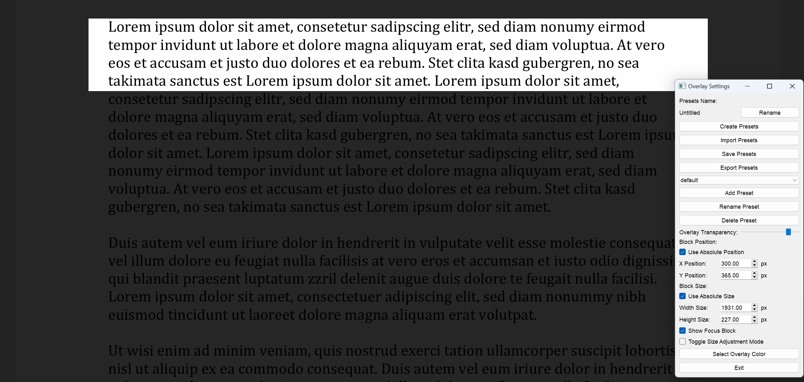

# Focus Frame

A tool to block outer areas of the screen and focus in the center.

# Images

# Functions
- Create preset collections and store them in files
- Create and arange many presets in one preset collection
- Adjust the size and position of the focus frame by draging (`Toggle Szie Adjustment mode`) or using spinbox (absolute or relative to screen size)
- Change color or transparency of the overlay. Toggle visibility of the overlay